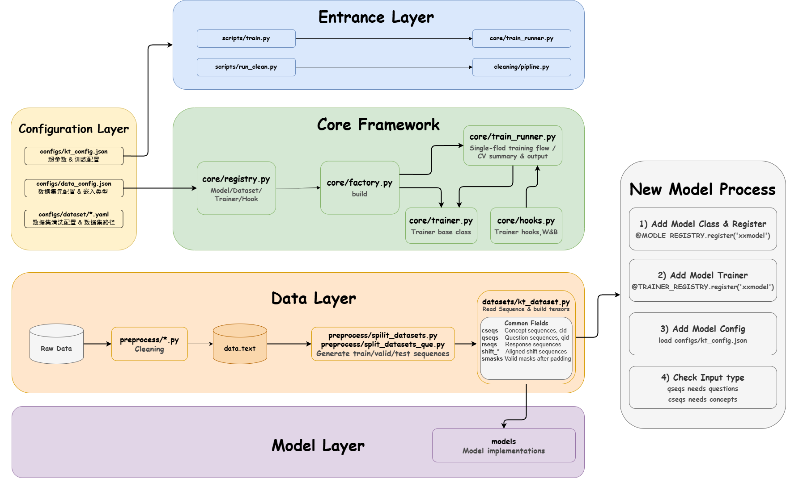

## KT-Toolkit

KT-Toolkit is a PyTorch research toolkit for Knowledge Tracing (KT). It covers
dataset cleaning, sequence preprocessing, model training, cross-validation,
experiment logging, and a lightweight WebUI orchestration layer.

## Architecture



The main training path is:

```text
scripts/train.py -> core/train_runner.py -> registry/factory -> datasets/models/trainers -> hooks/artifacts
```

The WebUI does not replace the training core. It starts the existing training
entrypoint as a managed job and reads metrics/logs from the same artifact
layout.

## Quick Start

Install the base dependencies, then PyTorch for your machine:

```bash
pip install -r requirements.txt
```

```bash
pip install torch==2.8.0 --index-url https://download.pytorch.org/whl/cu128
```

Use `.../whl/cpu` instead for a CPU-only machine. PyTorch is kept out of
`requirements.txt` because the correct wheel depends on the CUDA version;
`requirements-torch.txt` documents both options.

Run a single-fold experiment:

```bash
python scripts/train.py --dataset-name assist2009 --model-name dkt --fold 0 --use-wandb 0
```

Run cross-validation:

```bash
python scripts/train.py --dataset-name assist2009 --model-name dkt --cv 1 --folds 0-4 --use-wandb 0
```

Start the optional WebUI:

```bash
pip install -r requirements-web.txt
python scripts/serve_web.py --host 127.0.0.1 --port 8000
```

Then open `http://127.0.0.1:8000`.

## Running The Tests

```bash
pip install -r requirements-dev.txt
```

```bash
pytest
```

Use pytest, not `python -m unittest`. Five test files are written as plain
`test_` functions rather than `unittest.TestCase` subclasses, so unittest
collects nothing from them and still reports success -- 16 cases were silently
not running until this was noticed. `pytest.ini` pins collection to `tests/`,
which also keeps it out of `data/`, `saved_model/` and `wandb/`.

`tests/test_model_contracts.py` walks the model registry rather than naming
models, so a newly registered model is checked automatically: registration,
construction, a forward and backward pass, prediction/`smasks` alignment, finite
gradients, and that a future response cannot move a past prediction. See
docs/architecture.md for what it skips and why.

## Data Preparation

- Raw and processed dataset files live under `data/`.
- Dataset-specific cleaning adapters live under `cleaning/adapters/`.
- Legacy preprocessing and split utilities live under `preprocess/`.
- Runtime dataset loading is implemented in `datasets/`.
- Dataset metadata is configured in `configs/data_config.json`.

`KTDataset` and `KTQueDataset` read sequence CSV files and return aligned
`qseqs`, `cseqs`, `rseqs`, shifted targets, and masks.

Dataset pickle caches are written to `.cache/kt_dataset/` by default instead
of next to sequence CSV files. Set `KT_DATASET_CACHE_DIR` to override this.

## Configuration

- `configs/kt_config.json`: global training config and model hyperparameters.
- `configs/data_config.json`: dataset paths, input types, fold ids, and counts.
- `configs/dataset/*.yaml`: cleaning/preprocessing configs.
- `configs/wandb.json`: optional W&B credentials and project settings.

## Project Layout

- `core/`: training orchestration, registry, factory, hooks, and base trainer.
- `core/trainers/`: model-specific trainer implementations.
- `models/`: KT model implementations registered with `MODEL_REGISTRY`.
- `datasets/`: PyTorch dataset and dataloader builders.
- `preprocess/`: sequence generation utilities.
- `cleaning/`: dataset cleaning pipeline and adapters.
- `scripts/`: core training, data preparation, prediction, and WebUI CLI entrypoints.
- `webui/`: FastAPI + static WebUI orchestration layer.
- `docs/`: architecture and implementation notes.

## Adding A Model

1. Add `models/your_model.py` and register it with `@MODEL_REGISTRY.register("your_model")`.
2. Import it in `models/__init__.py` so registration happens at startup.
3. Add `core/trainers/your_model_trainer.py` and register it with `@TRAINER_REGISTRY.register("your_model")`.
4. Import the trainer in `core/trainers/__init__.py`.
5. Add model hyperparameters to `configs/kt_config.json`.
6. Confirm the dataset `input_type` provides the fields your trainer needs.

Registration is import-driven: if a module is not imported, its decorator will
not run.
