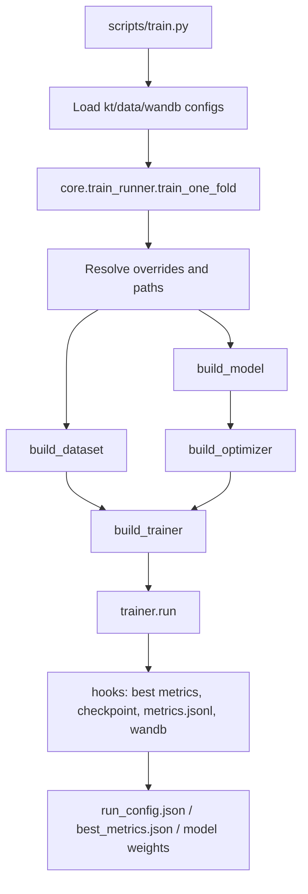
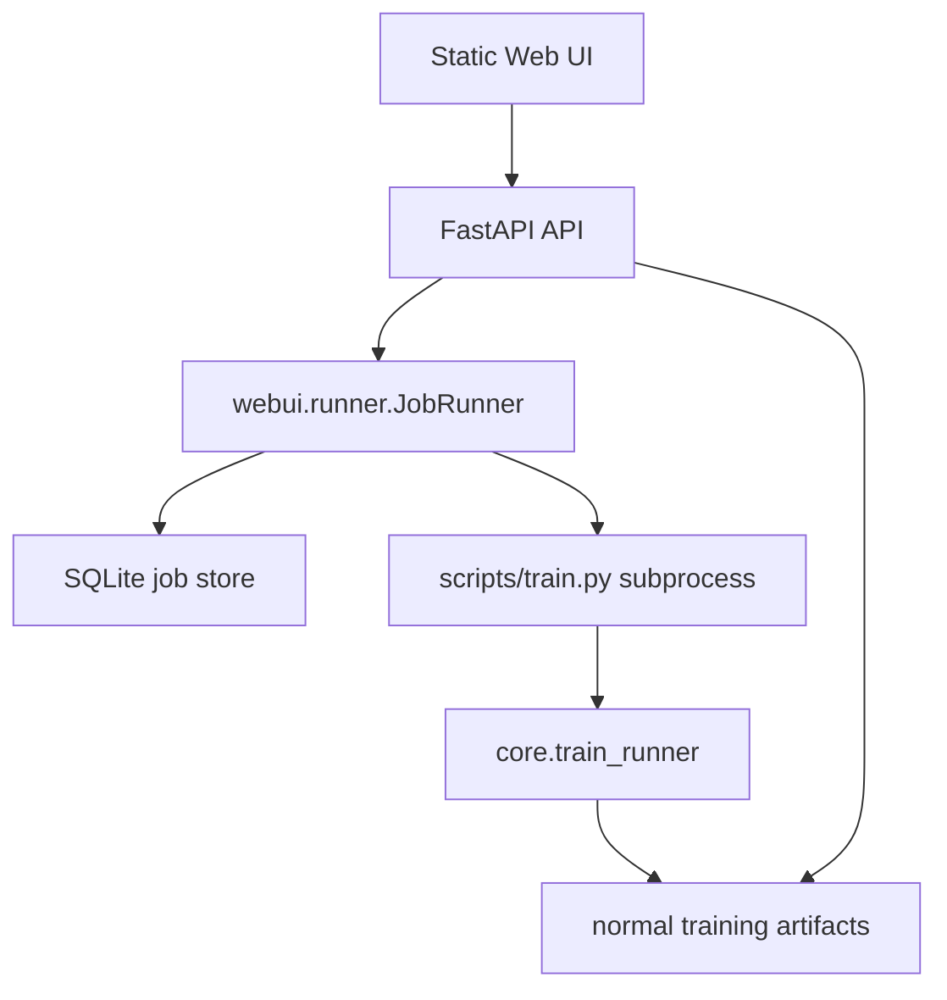

# KT-Toolkit Architecture

This document describes the project boundaries and the standard extension path
for datasets, models, trainers, and the WebUI.

## Layers

- Entry layer: core CLI scripts in `scripts/` and the optional WebUI in `webui/`.
- Research layer: study-specific reproduction and analysis workflows in
  `research/`, one directory per study. Code here may read artifacts and
  checkpoints, but the framework never imports it.
- Configuration layer: `configs/kt_config.json`, `configs/data_config.json`,
  and dataset YAML files.
- Core framework: registry, factory, hooks, base trainer, and training runner
  in `core/`.
- Data layer: cleaning adapters, preprocessing utilities, and PyTorch datasets.
- Model layer: KT model implementations in `models/`.
- Artifact layer: checkpoints, run configs, metrics JSONL, CV summaries, and
  logs.

## Training Flow



Cross-validation is a sequential loop over folds in `scripts/train.py`. Fold
results are aggregated into `cv_summary.json` and `cv_summary.csv`.

## WebUI Flow



The WebUI is intentionally a thin orchestration layer. It manages jobs,
captures logs, reads metrics, and writes per-job config overrides. It does not
duplicate model or training logic.

## Registry And Factory

The project uses import-time registration:

- `MODEL_REGISTRY` for model classes.
- `DATASET_REGISTRY` for dataloader builders.
- `TRAINER_REGISTRY` for trainer classes.

Factories in `core/factory.py` construct registered objects by name and filter
unsupported constructor arguments when possible.

Important rule: decorators only run after the module is imported. When adding a
model or trainer, update the package `__init__.py` so startup imports register
the new class.

## Dataset Fields

Common batch fields are:

- `qseqs`: question id sequence.
- `cseqs`: concept id sequence.
- `rseqs`: response sequence.
- `shft_*`: one-step shifted targets.
- `masks`: valid positions for model input.
- `smasks`: valid shifted positions for loss and metrics.
- `tseqs` and `itseqs`: optional timestamp features.

`KTDataset` handles one-dimensional concept/question sequences.
`KTQueDataset` handles question-level multi-concept sequences.

Dataset pickle caches are stored outside the data directory by default under
`.cache/kt_dataset/` (override with `KT_DATASET_CACHE_DIR`). The key covers
everything that changes the produced tensors: file path and mtime, fold
selection, timestamp mode, question-level mode, the optional feature maps
(dkt_forget stats, dimkt difficulty maps, hqaf attributes), and the
`score_repeated_kc` flag.

That last component is not optional. The flag changes the supervision mask, so
a pickle written under one setting must never be reused under the other; the
`screp0` / `screp1` marker in the key is what prevents a stale cache from
silently masking the repeated-KC fix.

## Evaluation Protocol

Two runs are only comparable when they scored the same positions the same way.
Each run therefore records a `protocol` block in `run_config.json`:

| Field | Meaning |
|---|---|
| `dataset_mode` | `all_in_one` (one row per question) or `one_by_one` (one row per KC) |
| `concept_mode` | `multi` (mask-mean pool every KC), `first` (keep only the first), or `expanded` |
| `concepts_visible` | `all` or `first_of_K` -- whether the model saw truncated KCs |
| `max_concepts` | KC slots per question |
| `score_repeated_kc` | `true` reproduces pyKT's behaviour, which scores duplicated KC rows |
| `eval_window` | whether the pyKT-comparable windowed test metric was computed |

`datasets/init_dataset.py::protocol_stamp` builds it. Before putting two runs in
the same table, check that their `protocol` blocks are identical --
`docs/evaluation_protocol.md` records what happens when they are not, including
the measured cost of KC truncation and of scoring repeated KC rows.

Both test metrics are reported: `best_test_auc` on the ordinary split and
`best_window_test_auc` on the windowed split, the latter being the
pyKT-comparable figure.

Neither is computed inside the epoch loop. Test scoring happens once, in
`train_one_fold`, against the best-validation checkpoint. The trainer used to
print test AUC every ten epochs behind a "read only" banner; that was removed,
because a number you can watch is a number you can tune against, and the banner
does not change what a person does with it. The canonical selection metric is
validation AUC.

A metric that cannot be computed is `None`, never a sentinel number. `-1` used
to stand in when `roc_auc_score` raised, which meant a single unscorable fold
was averaged into the cross-validation mean as a real score -- roughly -0.35 on
a five-fold mean -- while the fold count still read 5/5. `None` is skipped by
`aggregate_fold_metrics` and surfaces as a short count instead. A single-class
split warns and reports `None`; non-finite predictions or a target/prediction
length mismatch raise, because those are model bugs rather than scoring edge
cases.

## Adding A Model

1. Add a model class under `models/`.
2. Register it with `@MODEL_REGISTRY.register("your_model")`.
3. Import it in `models/__init__.py`.
4. Add a trainer under `core/trainers/`.
5. Register it with `@TRAINER_REGISTRY.register("your_model")`.
6. Import it in `core/trainers/__init__.py`.
7. Add default hyperparameters to `configs/kt_config.json`.
8. Verify that `configs/data_config.json` provides the required `input_type`.

`BaseTrainer` requires only `_train_epoch`; it already provides the epoch loop,
validation and test scoring, windowed test evaluation, early stopping, progress
output, and hook dispatch. In practice a trainer implements `_train_epoch` and
`_forward_batch`, where `_forward_batch` returns `(pred, target, loss)` with the
predictions and targets already flattened through the same `smasks`. Auxiliary
loss terms are added inside `_forward_batch`; several trainers subclass a
sibling rather than `BaseTrainer` when only the batch unpacking differs.

If the new model needs data the standard loaders do not produce -- a graph, a
difficulty map, precomputed statistics -- declare it as a nested `Inputs` class
on the model rather than adding a branch to the runner. See "Model Input Specs"
below.

## Model Input Specs

The registry removed per-model branching from model and trainer construction,
but not from feature preparation: `core/train_runner.py` dispatched on
`model_name` for every model needing data the standard loaders do not produce.
That is the same coupling the registry exists to remove, and it grew with each
such model.

A model now declares its own requirements as a nested `Inputs` class, defined in
`core/model_inputs.py`:

```python
@MODEL_REGISTRY.register("gkt")
class GKT(nn.Module):
    class Inputs(InputSpec):
        @classmethod
        def prepare(cls, ctx):
            return ModelInputs(model_kwargs={"graph": load_graph(ctx)})
```

`prepare` receives a `RunContext` (resolved dataset mode, this fold's config
copies, a file resolver, `train_folds()`) and returns a `ModelInputs` carrying
`model_kwargs`, `dataset_kwargs`, `model_cfg_updates`, `dataset_cfg_updates` and
`run_config_extras`. `validate` covers the declarative cases -- dataset mode and
the question-id requirement -- and `post_build` handles the one model that needs
surgery after construction.

Three rules the interface exists to enforce:

1. **`prepare` returns its effects.** The old blocks mutated `model_cfg_local`
   and `dataset_cfg_local` in place and later code read those mutations back, so
   what a block did could only be established by reading the rest of the file.
2. **`prepare` runs before `set_seed`.** Anything consuming the RNG afterwards
   shifts model initialisation, changing the metrics without changing the
   algorithm.
3. **Heavy imports go inside the method.** `models/` does not import `datasets/`;
   keeping `import models` cheap also stops a future cycle.

### Migration status

In progress, one model at a time. The `model_name` chain still handles the
models that have not moved, and shrinks as they do.

| Moved | Remaining |
|---|---|
| `gkt` | `dkt_pebg`, `lpkt`/`hdkt`, `dkt_forget`, `dimkt`, `hqaf`, `dgekt`, `hawkes` (post-build), and the three membership sets |

Suggested order, dirtiest last: dgekt, hawkes, dkt_pebg, dkt_forget, dimkt,
lpkt/hdkt, hqaf. The membership sets go last, once every model declares a spec.
`hqaf` is the worst case: it rides DIMKT's `difficulty_maps` channel, an alias
that is currently implicit and should become explicit in its spec.

Also deferred: `other_config_keys` in the runner is a blacklist that exists only
because `model_kwargs` is built by dumping the whole model config and filtering
it. Explicit `model_kwargs` should make it unnecessary, but removing it means
touching every model constructor -- a separate change, and one that would make
the equivalence diff too large to localise.

### Checking a move

Pure code motion must produce bit-identical metrics. Before moving a model:

```bash
python research/check_input_refactor.py record --models gkt --fold 0 --epochs 1
```

and after:

```bash
python research/check_input_refactor.py verify --models gkt --fold 0 --epochs 1
```

Metrics are compared exactly; "close" is a failure, because a small drift means
the RNG stream moved. `run_config.json` is diffed as a warning, where an
unexplained difference usually means a `model_cfg` key was left behind. Run it
per model -- batching five moves and failing does not say which one broke.

## Common Risks

- Mismatched `qseqs`/`cseqs` dimensions can cause embedding index errors.
- Prediction tensors must align with `shft_rseqs` and `smasks`.
- Updating config dictionaries in place can leak state between folds; use
  per-fold copies.
- Test metrics should not drive model selection. The canonical selection metric
  is validation AUC.
