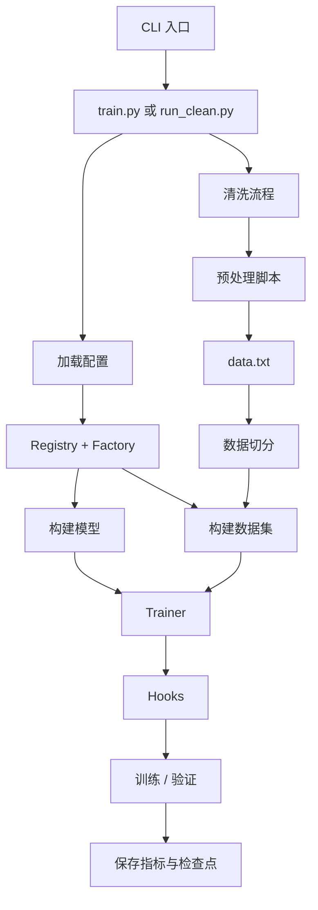
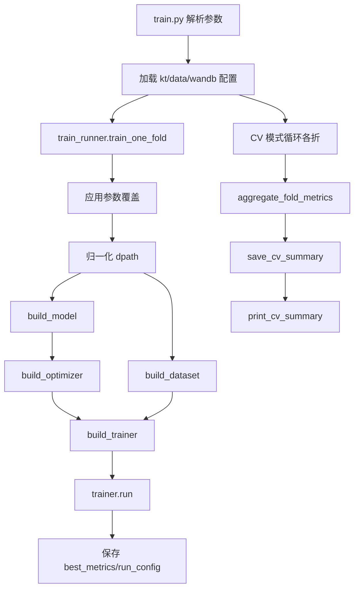
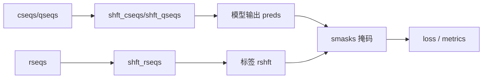

# kt-toolkit 架构梳理

## 目的
本文总结项目结构与新增模型的标准接入路径，便于后续扩展。

## 分层结构
- 入口层：`scripts/` 下的 CLI 脚本。
- 配置层：`configs/` 下的模型与数据配置。
- 核心框架：`core/` 下的注册表、工厂、hooks 与训练流程。
- 数据层：`preprocess/` 负责清洗，`datasets/` 负责加载。
- 模型层：`models/` 中的模型实现。

## 入口
- `scripts/train.py`：训练入口，解析参数后分发到 `core/train_runner.py`。
- `scripts/run_clean.py`：清洗入口，分发到 `cleaning/pipeline.py`。

## 核心框架
- `core/registry.py`：`MODEL/DATASET/TRAINER/HOOK` 注册中心。
- `core/factory.py`：`build_model/build_dataset/build_trainer` 工厂函数。
- `core/train_runner.py`：单折训练流程，CV 汇总与输出。
- `core/trainer.py`：训练器基类。
- `core/hooks.py`：训练 hooks（最佳指标、保存、W&B）。
- `core/device_info.py`：设备信息打印。

## 数据流
- 原始数据 -> `preprocess/*.py` -> `data.txt`。
- `preprocess/split_datasets.py` 与 `preprocess/split_datasets_que.py` 生成训练/验证/测试序列。
- `datasets/kt_dataset.py` 读取序列文件并构造成张量。

### 常用字段
- `cseqs`：概念序列（cid）。
- `qseqs`：题目序列（qid）。
- `rseqs`：作答序列。
- `shft_*`：对齐的 shift 序列。
- `smasks`：padding 后的有效掩码。

## 配置
- `configs/kt_config.json`：模型超参与训练配置。
- `configs/data_config.json`：数据集元信息、文件名、`input_type`。
- `configs/dataset/*.yaml`：清洗参数与路径。

## 新增模型流程
1) **新增模型类**（`models/`）并注册：
   - `@MODEL_REGISTRY.register("your_model")`
2) **新增训练器**（`core/trainers/`，若需自定义逻辑）：
   - `@TRAINER_REGISTRY.register("your_model")`
   - 若逻辑一致可复用已有 trainer。
3) **增加模型配置**：在 `configs/kt_config.json` 中添加。
4) **检查 input_type**：
   - 使用 `qseqs` 时需包含 `questions`。
   - 使用 `cseqs` 时需包含 `concepts`。

## 常见坑
- `qseqs/cseqs` 不匹配导致 embedding 越界。
- 序列长度未对齐，`preds` 与 `smasks/rshft` 维度不一致。
- 直接修改配置 dict 造成隐式副作用，建议在 `train_runner` 内部复制。

## 扩展建议
- 在 `core/hooks.py` 增加新的 hook。
- 在 trainer 中增加模型专用评估指标。
- 在 `preprocess/` 增加数据集清洗脚本，并在 `cleaning/adapters/` 注册。

## 整体框架流程图

## 训练流程细化图

## 数据字段对齐示意图

