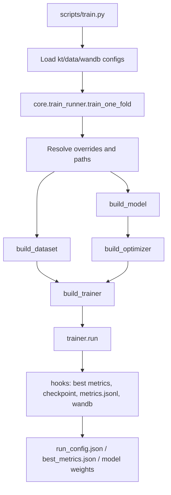
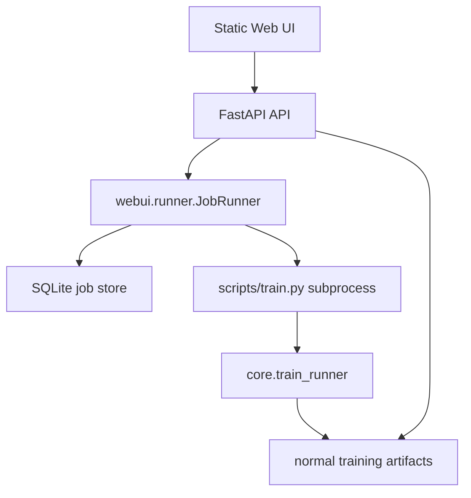

# KT-Toolkit Architecture

This document describes the project boundaries and the standard extension path
for datasets, models, trainers, and the WebUI.

## Layers

- Entry layer: core CLI scripts in `scripts/` and the optional WebUI in `webui/`.
- Research layer: study-specific reproduction and analysis workflows in
  `research/`, one directory per study. Code here may read artifacts and
  checkpoints, but the framework never imports it.
- Configuration layer: `configs/kt_config.json`, `configs/data_config.json`,
  and dataset YAML files.
- Core framework: registry, factory, hooks, base trainer, and training runner
  in `core/`.
- Data layer: cleaning adapters, preprocessing utilities, and PyTorch datasets.
- Model layer: KT model implementations in `models/`.
- Artifact layer: checkpoints, run configs, metrics JSONL, CV summaries, and
  logs.

## Training Flow

Cross-validation is a sequential loop over folds in `scripts/train.py`. Fold
results are aggregated into `cv_summary.json` and `cv_summary.csv`.

## WebUI Flow

The WebUI is intentionally a thin orchestration layer. It manages jobs,
captures logs, reads metrics, and writes per-job config overrides. It does not
duplicate model or training logic.

## Registry And Factory

The project uses import-time registration:

- `MODEL_REGISTRY` for model classes.
- `DATASET_REGISTRY` for dataloader builders.
- `TRAINER_REGISTRY` for trainer classes.

Factories in `core/factory.py` construct registered objects by name and filter
unsupported constructor arguments when possible.

Important rule: decorators only run after the module is imported. When adding a
model or trainer, update the package `__init__.py` so startup imports register
the new class.

## Dataset Fields

Common batch fields are:

- `qseqs`: question id sequence.
- `cseqs`: concept id sequence.
- `rseqs`: response sequence.
- `shft_*`: one-step shifted targets.
- `masks`: valid positions for model input.
- `smasks`: valid shifted positions for loss and metrics.
- `tseqs` and `itseqs`: optional timestamp features.

`KTDataset` handles one-dimensional concept/question sequences.
`KTQueDataset` handles question-level multi-concept sequences.

Dataset pickle caches are stored outside the data directory by default under
`.cache/kt_dataset/` (override with `KT_DATASET_CACHE_DIR`). The key covers
everything that changes the produced tensors: file path and mtime, fold
selection, timestamp mode, question-level mode, the optional feature maps
(dkt_forget stats, dimkt difficulty maps, hqaf attributes), and the
`score_repeated_kc` flag.

That last component is not optional. The flag changes the supervision mask, so
a pickle written under one setting must never be reused under the other; the
`screp0` / `screp1` marker in the key is what prevents a stale cache from
silently masking the repeated-KC fix.

## Evaluation Protocol

Two runs are only comparable when they scored the same positions the same way.
Each run therefore records a `protocol` block in `run_config.json`:

| Field | Meaning |
|---|---|
| `dataset_mode` | `all_in_one` (one row per question) or `one_by_one` (one row per KC) |
| `concept_mode` | `multi` (mask-mean pool every KC), `first` (keep only the first), or `expanded` |
| `concepts_visible` | `all` or `first_of_K` -- whether the model saw truncated KCs |
| `max_concepts` | KC slots per question |
| `score_repeated_kc` | `true` reproduces pyKT's behaviour, which scores duplicated KC rows |
| `eval_window` | whether the pyKT-comparable windowed test metric was computed |

`datasets/init_dataset.py::protocol_stamp` builds it. Before putting two runs in
the same table, check that their `protocol` blocks are identical --
`docs/evaluation_protocol.md` records what happens when they are not, including
the measured cost of KC truncation and of scoring repeated KC rows.

Both test metrics are reported: `best_test_auc` on the ordinary split and
`best_window_test_auc` on the windowed split, the latter being the
pyKT-comparable figure. The windowed evaluation runs once, on the
best-validation checkpoint, never inside the epoch loop.

## Adding A Model

1. Add a model class under `models/`.
2. Register it with `@MODEL_REGISTRY.register("your_model")`.
3. Import it in `models/__init__.py`.
4. Add a trainer under `core/trainers/`.
5. Register it with `@TRAINER_REGISTRY.register("your_model")`.
6. Import it in `core/trainers/__init__.py`.
7. Add default hyperparameters to `configs/kt_config.json`.
8. Verify that `configs/data_config.json` provides the required `input_type`.

`BaseTrainer` requires only `_train_epoch`; it already provides the epoch loop,
validation and test scoring, windowed test evaluation, early stopping, progress
output, and hook dispatch. In practice a trainer implements `_train_epoch` and
`_forward_batch`, where `_forward_batch` returns `(pred, target, loss)` with the
predictions and targets already flattened through the same `smasks`. Auxiliary
loss terms are added inside `_forward_batch`; several trainers subclass a
sibling rather than `BaseTrainer` when only the batch unpacking differs.

If the new model needs data the standard loaders do not produce -- a graph, a
difficulty map, precomputed statistics -- that wiring currently lives in
`core/train_runner.py` behind a `model_name` check. See the note below.

## Known Structural Debt

The registry removed per-model branching from model and trainer construction,
but not from feature preparation. `core/train_runner.py` still dispatches on
`model_name` for the extra inputs some models need: LPKT time indices, the
DKT-PEBG booster, dkt_forget gap statistics, DIMKT difficulty maps, the GKT
graph, the DGEKT hypergraph, HQAF feature maps, plus two membership sets that
decide dataset mode and question-id requirements.

This is the same shape of coupling the registry was introduced to remove, and it
grows with every model that needs bespoke inputs. A single model's requirements
are spread across the file rather than declared in one place: `hqaf` appears in
both membership sets, in the feature-map block, in two `model_kwargs`
injections, and in the dataset kwargs -- and nothing at import time catches a
missed entry.

The fix is to move each case behind a model-side hook so the runner only
orchestrates. Two constraints on that refactor: the current blocks mutate
`model_cfg_local` and `dataset_cfg_local` in place and later code reads those
mutations back (including through the `other_config_keys` filter, which routes
`num_at`/`num_it`/`use_timestamps` around `model_kwargs`), and every hook must
run before `set_seed`, or model initialisation draws from a different RNG
stream. Equivalence is checkable: same seed and fold must reproduce the metrics
exactly.

Until then, adding a model with unusual inputs means editing the runner.

## Common Risks

- Mismatched `qseqs`/`cseqs` dimensions can cause embedding index errors.
- Prediction tensors must align with `shft_rseqs` and `smasks`.
- Updating config dictionaries in place can leak state between folds; use
  per-fold copies.
- Test metrics should not drive model selection. The canonical selection metric
  is validation AUC.
