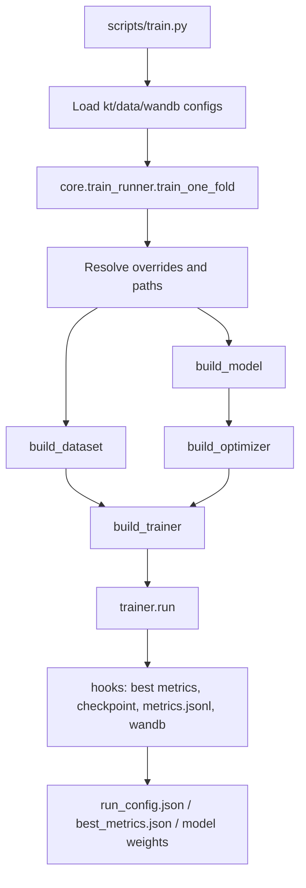
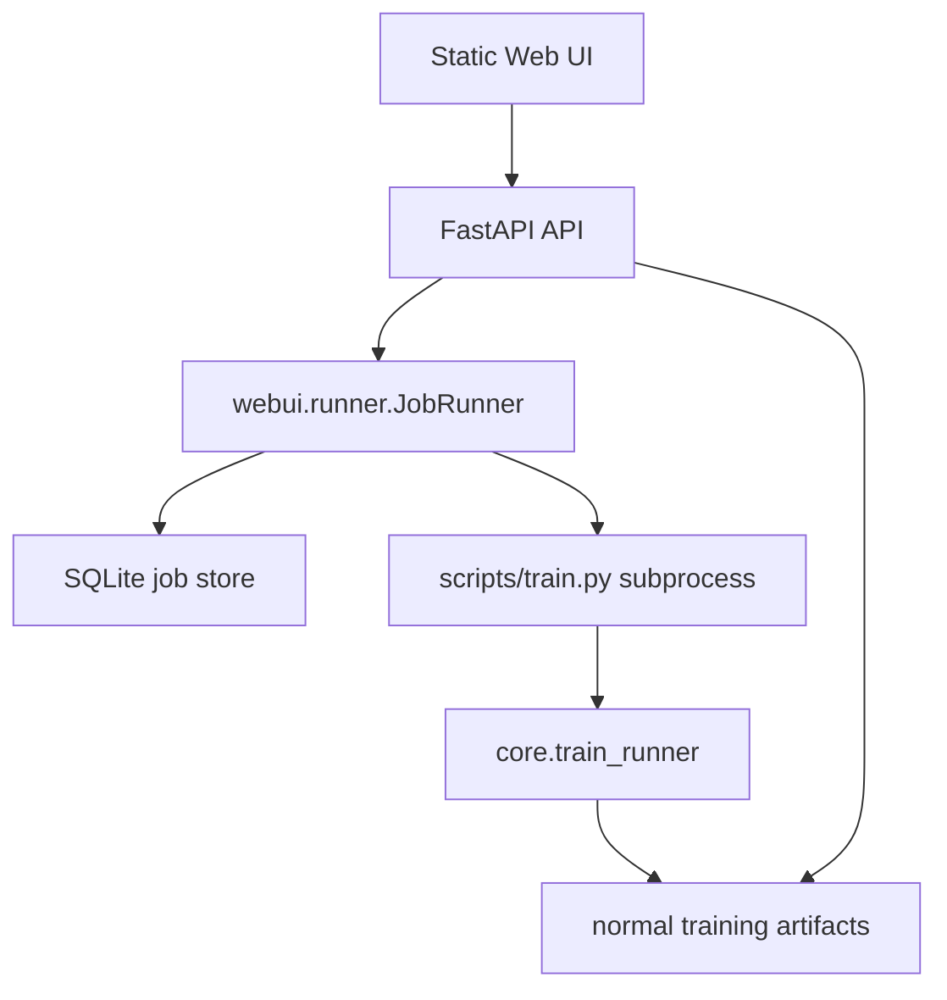

# KT-Toolkit Architecture

This document describes the project boundaries and the standard extension path
for datasets, models, trainers, and the WebUI.

## Layers

- Entry layer: core CLI scripts in `scripts/` and the optional WebUI in `webui/`.
- Research layer: paper-specific reproduction and analysis workflows in
  `research/`, currently grouped under `research/removed_model/`.
- Configuration layer: `configs/kt_config.json`, `configs/data_config.json`,
  and dataset YAML files.
- Core framework: registry, factory, hooks, base trainer, and training runner
  in `core/`.
- Data layer: cleaning adapters, preprocessing utilities, and PyTorch datasets.
- Model layer: KT model implementations in `models/`.
- Artifact layer: checkpoints, run configs, metrics JSONL, CV summaries, and
  logs.

## Training Flow

Cross-validation is a sequential loop over folds in `scripts/train.py`. Fold
results are aggregated into `cv_summary.json` and `cv_summary.csv`.

## WebUI Flow

The WebUI is intentionally a thin orchestration layer. It manages jobs,
captures logs, reads metrics, and writes per-job config overrides. It does not
duplicate model or training logic.

## Registry And Factory

The project uses import-time registration:

- `MODEL_REGISTRY` for model classes.
- `DATASET_REGISTRY` for dataloader builders.
- `TRAINER_REGISTRY` for trainer classes.

Factories in `core/factory.py` construct registered objects by name and filter
unsupported constructor arguments when possible.

Important rule: decorators only run after the module is imported. When adding a
model or trainer, update the package `__init__.py` so startup imports register
the new class.

## Dataset Fields

Common batch fields are:

- `qseqs`: question id sequence.
- `cseqs`: concept id sequence.
- `rseqs`: response sequence.
- `shft_*`: one-step shifted targets.
- `masks`: valid positions for model input.
- `smasks`: valid shifted positions for loss and metrics.
- `tseqs` and `itseqs`: optional timestamp features.

`KTDataset` handles one-dimensional concept/question sequences.
`KTQueDataset` handles question-level multi-concept sequences.

Dataset pickle caches are stored outside the data directory by default under
`.cache/kt_dataset/`, keyed by path, mtime, fold selection, timestamp mode, and
question-level mode.

## Adding A Model

1. Add a model class under `models/`.
2. Register it with `@MODEL_REGISTRY.register("your_model")`.
3. Import it in `models/__init__.py`.
4. Add a trainer under `core/trainers/`.
5. Register it with `@TRAINER_REGISTRY.register("your_model")`.
6. Import it in `core/trainers/__init__.py`.
7. Add default hyperparameters to `configs/kt_config.json`.
8. Verify that `configs/data_config.json` provides the required `input_type`.

If the trainer follows the standard binary KT pattern, it only needs to
implement `_train_epoch` and `_forward_batch`; the base trainer can provide
validation, test evaluation, and early stopping.

## Common Risks

- Mismatched `qseqs`/`cseqs` dimensions can cause embedding index errors.
- Prediction tensors must align with `shft_rseqs` and `smasks`.
- Updating config dictionaries in place can leak state between folds; use
  per-fold copies.
- Test metrics should not drive model selection. The canonical selection metric
  is validation AUC.
