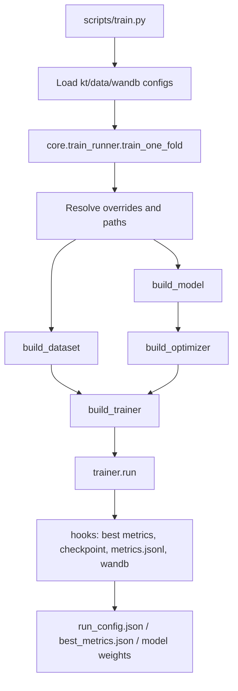
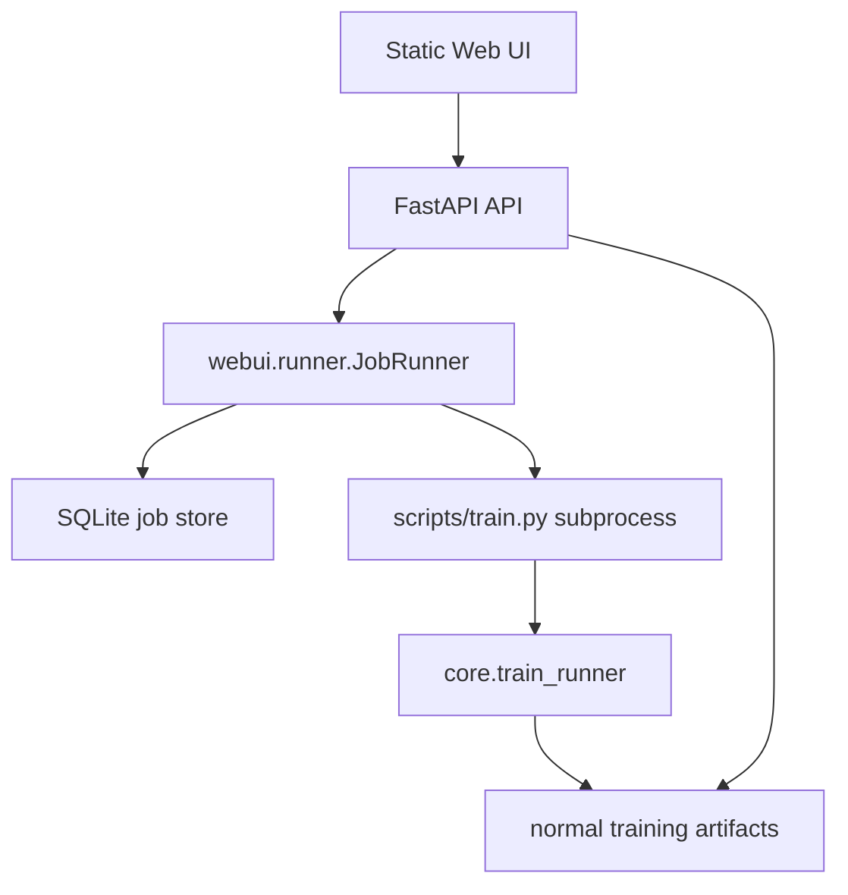

# KT-Toolkit Architecture

This document describes the project boundaries and the standard extension path
for datasets, models, trainers, and the WebUI.

## Layers

- Entry layer: core CLI scripts in `scripts/` and the optional WebUI in `webui/`.
- Research layer: study-specific reproduction and analysis workflows in
  `research/`, one directory per study. Code here may read artifacts and
  checkpoints, but the framework never imports it.
- Configuration layer: `configs/kt_config.json`, `configs/data_config.json`,
  and dataset YAML files.
- Core framework: registry, factory, hooks, base trainer, and training runner
  in `core/`.
- Data layer: cleaning adapters, preprocessing utilities, and PyTorch datasets.
- Model layer: KT model implementations in `models/`.
- Artifact layer: checkpoints, run configs, metrics JSONL, CV summaries, and
  logs.

## Training Flow



Cross-validation is a sequential loop over folds in `scripts/train.py`. Fold
results are aggregated into `cv_summary.json` and `cv_summary.csv`.

## WebUI Flow



The WebUI is intentionally a thin orchestration layer. It manages jobs,
captures logs, reads metrics, and writes per-job config overrides. It does not
duplicate model or training logic.

## Registry And Factory

The project uses import-time registration:

- `MODEL_REGISTRY` for model classes.
- `DATASET_REGISTRY` for dataloader builders.
- `TRAINER_REGISTRY` for trainer classes.

Factories in `core/factory.py` construct registered objects by name and filter
unsupported constructor arguments when possible.

Important rule: decorators only run after the module is imported. When adding a
model or trainer, update the package `__init__.py` so startup imports register
the new class.

## Dataset Fields

Common batch fields are:

- `qseqs`: question id sequence.
- `cseqs`: concept id sequence.
- `rseqs`: response sequence.
- `shft_*`: one-step shifted targets.
- `masks`: valid positions for model input.
- `smasks`: valid shifted positions for loss and metrics.
- `tseqs` and `itseqs`: optional timestamp features.

`KTDataset` handles one-dimensional concept/question sequences.
`KTQueDataset` handles question-level multi-concept sequences.

Dataset pickle caches are stored outside the data directory by default under
`.cache/kt_dataset/` (override with `KT_DATASET_CACHE_DIR`). The key covers
everything that changes the produced tensors: file path and mtime, fold
selection, timestamp mode, question-level mode, the optional feature maps
(dkt_forget stats, dimkt difficulty maps, hqaf attributes), and the
`score_repeated_kc` flag.

That last component is not optional. The flag changes the supervision mask, so
a pickle written under one setting must never be reused under the other; the
`screp0` / `screp1` marker in the key is what prevents a stale cache from
silently masking the repeated-KC fix.

## Evaluation Protocol

Two runs are only comparable when they scored the same positions the same way.
Each run therefore records a `protocol` block in `run_config.json`:

| Field | Meaning |
|---|---|
| `dataset_mode` | `all_in_one` (one row per question) or `one_by_one` (one row per KC) |
| `concept_mode` | `multi` (mask-mean pool every KC), `first` (keep only the first), or `expanded` |
| `concepts_visible` | `all` or `first_of_K` -- whether the model saw truncated KCs |
| `max_concepts` | KC slots per question |
| `score_repeated_kc` | `true` reproduces pyKT's behaviour, which scores duplicated KC rows |
| `eval_window` | whether the pyKT-comparable windowed test metric was computed |
| `feature_fit_scope` | which splits the run's derived features were fitted from |
| `graph_scope` | the same, for a concept graph |

The last two are `none`, `train_folds` or `train_valid_test`, and they are
descriptive rather than a claim that the value is correct. None of the features
in question reads responses, so none of it is label leakage; what the scope
decides is whether a run is **transductive** -- whether the model's structure was
built already knowing what the test set contains, which is not a thing you have
in deployment.

The scopes are genuinely mixed:

| Model | Scope | Why |
|---|---|---|
| `dimkt`, `hqaf`, `lpkt`/`hdkt` | `train_folds` | already pass `folds=train_folds` |
| `dkt_forget` | `train_valid_test` | gap dimensions are a max over every split |
| `gkt` (transition) | `train_valid_test` | transition counts include the test file |
| `dgekt` | `train_valid_test` | `include_test_question_metadata` on by default |
| everything else | `none` | derives nothing from the data |

pyKT does the same in all three transductive cases -- checked against its
`init_model.py` and `init_dataset.py` -- so changing the behaviour means losing
comparability with every published baseline, the same trade as the ASSISTments
scaffolding filter. Recording it costs nothing and makes the question answerable
from an artifact.

The value is set at the site that does the fitting, not from a lookup table,
because a table drifts from the code. A model that has moved to an `Inputs` spec
reports its own through `run_config_extras`, as `gkt` does.

`datasets/init_dataset.py::protocol_stamp` builds it, and
`scripts/run_baseline_table.py::protocol_key` groups on **all eight fields**. A
field that is recorded but not grouped on is decorative: it sits in the artifact
while runs with different values still land in the same table. A field missing
from an older artifact becomes `unknown` rather than a default, since a run that
recorded nothing must not be assumed to match one that did.

`docs/evaluation_protocol.md` records what happens when blocks do not match,
including the measured cost of KC truncation and of scoring repeated KC rows.

`eval_window` describes what happened, not what was requested: a run that wanted
a windowed metric and could not build the loader records `false`, so it cannot
group with runs that have the number.

Both test metrics are reported: `best_test_auc` on the ordinary split and
`best_window_test_auc` on the windowed split, the latter being the
pyKT-comparable figure.

Neither is computed inside the epoch loop. Test scoring happens once, in
`train_one_fold`, against the best-validation checkpoint. The trainer used to
print test AUC every ten epochs behind a "read only" banner; that was removed,
because a number you can watch is a number you can tune against, and the banner
does not change what a person does with it. The canonical selection metric is
validation AUC.

A test or windowed-test loader that cannot be used stops the run -- whether it
failed to build or its file is simply absent. Both used to end the same way:
the fold finished looking successful with no test metric and then dropped out of
the cross-validation mean. A missing file was the quieter of the two, because it
never reached an exception handler at all.
`allow_missing_test_loader: true` in the training config restores
warn-and-continue where it is genuinely expected.

The last-epoch checkpoint is also scored, but only when `eval_last_epoch: true`
is set in the training config. It answers a diagnostic question -- how far the
model drifted after its best validation epoch -- and is not a reportable result,
so by default a run touches the test set exactly once. With the flag off,
`last_test_auc` and `last_test_acc` are simply absent from `best_metrics.json`
rather than present and ignorable.

A metric that cannot be computed is `None`, never a sentinel number. `-1` used
to stand in when `roc_auc_score` raised, which meant a single unscorable fold
was averaged into the cross-validation mean as a real score -- roughly -0.35 on
a five-fold mean -- while the fold count still read 5/5. `None` is skipped by
`aggregate_fold_metrics` and surfaces as a short count instead. A single-class
split warns and reports `None`; non-finite predictions or a target/prediction
length mismatch raise, because those are model bugs rather than scoring edge
cases.

## Adding A Model

1. Add a model class under `models/`.
2. Register it with `@MODEL_REGISTRY.register("your_model")`.
3. Import it in `models/__init__.py`.
4. Add a trainer under `core/trainers/`.
5. Register it with `@TRAINER_REGISTRY.register("your_model")`.
6. Import it in `core/trainers/__init__.py`.
7. Add default hyperparameters to `configs/kt_config.json`.
8. Verify that `configs/data_config.json` provides the required `input_type`.

`BaseTrainer` requires only `_train_epoch`; it already provides the epoch loop,
validation and test scoring, windowed test evaluation, early stopping, progress
output, and hook dispatch. In practice a trainer implements `_train_epoch` and
`_forward_batch`, where `_forward_batch` returns `(pred, target, loss)` with the
predictions and targets already flattened through the same `smasks`. Auxiliary
loss terms are added inside `_forward_batch`; several trainers subclass a
sibling rather than `BaseTrainer` when only the batch unpacking differs.

If the new model needs data the standard loaders do not produce -- a graph, a
difficulty map, precomputed statistics -- declare it as a nested `Inputs` class
on the model rather than adding a branch to the runner. See "Model Input Specs"
below.

## Model Input Specs

The registry removed per-model branching from model and trainer construction,
but not from feature preparation: `core/train_runner.py` dispatched on
`model_name` for every model needing data the standard loaders do not produce.
That is the same coupling the registry exists to remove, and it grew with each
such model.

A model now declares its own requirements as a nested `Inputs` class, defined in
`core/model_inputs.py`:

```python
@MODEL_REGISTRY.register("gkt")
class GKT(nn.Module):
    class Inputs(InputSpec):
        @classmethod
        def prepare(cls, ctx):
            return ModelInputs(model_kwargs={"graph": load_graph(ctx)})
```

`prepare` receives a `RunContext` (resolved dataset mode, this fold's config
copies, a file resolver, `train_folds()`) and returns a `ModelInputs` carrying
`model_kwargs`, `dataset_kwargs`, `model_cfg_updates`, `dataset_cfg_updates` and
`run_config_extras`. `validate` covers the question-id requirement, and
`post_build` handles the one model that needs surgery after construction.

`Inputs.dataset_mode` is consulted by `resolve_dataset_mode`, which the runner
calls after looking the spec up, in this order:

1. CLI override
2. the model's config block
3. `Inputs.dataset_mode`
4. `ALL_IN_ONE_MODELS` / `ONE_BY_ONE_MODELS`
5. the global training config

The declaration sits above the membership sets so that moving a model to a spec
releases it from them. Anything that needs the resolved mode -- including the
contract tests -- must call `resolve_dataset_mode` rather than derive it, or it
runs the model in a configuration that never occurs.

Three rules the interface exists to enforce:

1. **`prepare` returns its effects.** The old blocks mutated `model_cfg_local`
   and `dataset_cfg_local` in place and later code read those mutations back, so
   what a block did could only be established by reading the rest of the file.
2. **`prepare` runs before `set_seed`.** Anything consuming the RNG afterwards
   shifts model initialisation, changing the metrics without changing the
   algorithm.
3. **Heavy imports go inside the method.** `models/` does not import `datasets/`;
   keeping `import models` cheap also stops a future cycle.

### Migration status

In progress, one model at a time. The `model_name` chain still handles the
models that have not moved, and shrinks as they do.

| Moved | Remaining |
|---|---|
| `gkt` | `dkt_pebg`, `lpkt`/`hdkt`, `dkt_forget`, `dimkt`, `hqaf`, `dgekt`, `hawkes` (post-build), and the three membership sets |

Suggested order, dirtiest last: dgekt, hawkes, dkt_pebg, dkt_forget, dimkt,
lpkt/hdkt, hqaf. The membership sets go last, once every model declares a spec.
`hqaf` is the worst case: it rides DIMKT's `difficulty_maps` channel, an alias
that is currently implicit and should become explicit in its spec.

Also deferred: `other_config_keys` in the runner is a blacklist that exists only
because `model_kwargs` is built by dumping the whole model config and filtering
it. Explicit `model_kwargs` should make it unnecessary, but removing it means
touching every model constructor -- a separate change, and one that would make
the equivalence diff too large to localise.

### Checking a move

Pure code motion must produce bit-identical metrics. Before moving a model:

```bash
python research/check_input_refactor.py record --models gkt --fold 0 --epochs 1
```

and after:

```bash
python research/check_input_refactor.py verify --models gkt --fold 0 --epochs 1
```

Metrics are compared exactly; "close" is a failure, because a small drift means
the RNG stream moved. `run_config.json` is diffed as a warning, where an
unexplained difference usually means a `model_cfg` key was left behind. Run it
per model -- batching five moves and failing does not say which one broke.

## Model Contract Tests

`tests/test_model_contracts.py` walks the registry rather than naming models, so
a new model is covered as soon as it is registered. Per model it checks that the
model and trainer are registered together, that a config block exists, that the
model constructs, that a small batch runs forward and backward, that predictions
line up with `smasks`, that loss and gradients are finite, and that flipping the
last response leaves earlier predictions alone.

Four models are skipped with a stated reason, because their forward needs an
artefact the harness does not build: `gkt` and `dgekt` need graphs derived from
real sequences, `dkt_pebg` a pretrained booster, `hawkes` the double-precision
setup the runner applies. The skip list is the honest statement of what is still
uncovered.

Determinism is checked before causality, not inside it. A non-deterministic
forward makes the causality result unreadable: a difference after flipping a
response could be the leak or could be the noise. When LPKT first failed the
causality check the difference was attributed to cuBLAS reduction ordering,
which was wrong -- `models/lpkt.py:252` calls `nn.init.xavier_uniform_` inside
`forward` whenever `initial_knowledge` is `None`, re-drawing the entire initial
state on every pass. Seeding made it reproduce exactly, which was the signal.
A separate determinism test says so in one line.

That LPKT path is reachable rather than hypothetical: `initial_knowledge` is a
learned parameter only when `use_runtime_concepts` is on, which the runner ties
to `all_in_one`. Running LPKT `one_by_one` re-randomises its initial knowledge
state every forward, so its evaluation is not reproducible.

`KNOWN_ALIGNMENT_VIOLATIONS`, `KNOWN_RANGE_VIOLATIONS` and
`KNOWN_NONDETERMINISM` record violations rather than skipping them. The tests
assert that a recorded violation still fails, so an entry must be deleted when
its model is fixed, and a model that starts violating without an entry breaks the
build. All three are currently empty, which is the intended steady state.

All three held IEKT when the suite was first written, and all three are fixed:

- `train_one_step` derived its scored positions from
  `seq_num = (qseqs != 0).sum() + 1` and took that many columns from the front of
  the rollout. The `+1` was meant to absorb the column that `data_new['cc']`
  prepends, but as a length it instead kept column 0 -- the learner's first
  response, which no protocol scores -- and dropped the last. `!= 0` also treats
  question id 0 as padding although it is a legitimate id, so the error varied
  by row. Measured on assist2009 fold 0, first batch of 64: 4556 scored positions
  where `smasks` selected 3886. Positions now come from `smasks` applied to
  `[:, 1:]`, since column `j + 1` predicts the target `smasks[:, j]` marks.
- The prediction head is a bare `nn.Linear`, so `train_one_step` returned raw
  logits. The loss wants those -- it uses `BCEWithLogitsLoss` -- but
  `_score_loader` thresholds accuracy at `p >= 0.5`, which is meaningless for a
  non-probability. It now returns `sigmoid(y)` while the loss keeps the logits.
- Policy actions were drawn with `Categorical(...).sample()` on every forward,
  with no `self.training` guard, so evaluation sampled a fresh rollout each time
  and the same batch scored twice differed by 0.287. Sampling is required during
  training, because the REINFORCE gradient is defined against that distribution;
  at evaluation the action is now the argmax.

IEKT results produced before 2026-09-17 are not comparable with results produced
after: the scored positions changed, and so did the RL reward normalisation that
shared the same broken length.

Four things the harness had to match exactly, each found by getting it wrong and
reading the resulting model-side error:

- `rseqs` is float32 and `masks`/`smasks` are bool.
- A batch carries `seq_len - 1` positions, since the dataset builds inputs from
  `cur[:-1]`.
- The dataset mode must come from `resolve_dataset_mode`. Deriving it from
  `Inputs.dataset_mode` alone put every model except `gkt` on `one_by_one`, and
  built LPKT with `use_runtime_concepts` off -- a path no real run takes.
- 3-D concepts appear only when the mode is `all_in_one` *and* the model is in
  `MULTI_CONCEPT_MODELS`. `rekt` and `gkt` keep per-KC state indexed by a single
  skill id, so they are fed `cseqs[:, 0]` even under `all_in_one`.

The last two are the same lesson: anything the runner or the loader decides has
to be asked for, not reproduced.

### Device handling

A model must run on the device it is given. Thirteen files hold a module-level
`device = torch.device("cuda" if torch.cuda.is_available() else "cpu")`, and
several reached for it instead of the argument, so on a machine with a GPU they
could not be forced onto CPU at all.

Fixed:

- `models/utils.py` and `models/atkt.py`: `ut_mask` and `pos_encode` now take
  `target_device`, matching the convention `models/saint.py` already used. The
  two call sites pass the device of a tensor they already hold.
- `models/iekt.py`: `IEKT.__init__` had no `device` parameter at all, so
  `build_model`'s signature filter dropped the argument, and the constructor
  then rebuilt `device` from a fresh `torch.cuda.is_available()` check. Beyond
  blocking CPU, that silently ignored `--gpu_id`: `cuda:1` still built on
  `cuda:0`.

`test_4b_a_model_built_on_cpu_stays_on_cpu` pins this. It is skipped when no GPU
is present, where the module-level default happens to be right and the test
would prove nothing. All 31 exercised models now pass on both CPU and CUDA.

Still present, not yet a defect: `dtransformer`, `robustkt`, `sparsekt` and
`stablekt` open their forward with `global device; device = q.device`, rebinding
the module global from the input. It gives the right answer and is not
thread-safe; converting it to a local is mechanical but touches up to eighteen
sites in one file, so it is left for a change that can be checked on its own.

## Common Risks

- Mismatched `qseqs`/`cseqs` dimensions can cause embedding index errors.
- Prediction tensors must align with `shft_rseqs` and `smasks`.
- Updating config dictionaries in place can leak state between folds; use
  per-fold copies.
- Test metrics should not drive model selection. The canonical selection metric
  is validation AUC.
