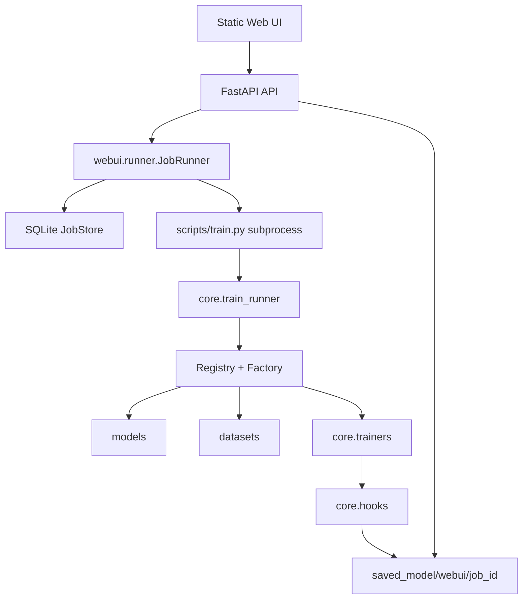

# KT-Toolkit WebUI Architecture

## Goal

The WebUI is an orchestration layer around the existing CLI training framework.
It must not duplicate model, dataset, trainer, or evaluation logic.

## Runtime Boundary

## Design Rules

- The WebUI starts training by launching `scripts/train.py` as a child process.
- Training artifacts remain compatible with the current CLI layout.
- Each WebUI job gets an isolated save directory under `.webui/runs/<job_id>`.
- Job metadata is stored in SQLite at `.webui/jobs.sqlite3`.
- The API reads `metrics.jsonl`, `best_metrics.json`, and `cv_summary.json` from artifacts.
- CLI behavior remains unchanged.

## Main API

- `GET /api/configs`: dataset/model names and defaults from `configs`.
- `POST /api/jobs`: create and start a training job.
- `GET /api/jobs`: list jobs.
- `GET /api/jobs/{job_id}`: inspect one job.
- `POST /api/jobs/{job_id}/stop`: stop a running job.
- `GET /api/jobs/{job_id}/log`: tail the captured training log.
- `GET /api/jobs/{job_id}/metrics`: read epoch metrics and best metrics.

## Extension Path

Add scheduling, comparison, authentication, and GPU reservation above
`JobRunner`. Keep the training implementation in `core` and the orchestration
implementation in `webui`.
